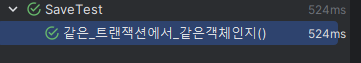
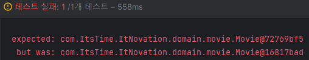
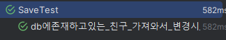
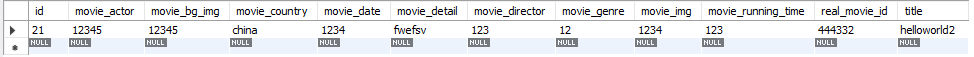

## xxxReposiotry.findByxx 했을때의 객체랑 기존 xxx객체랑 equal비교하면 어떻게 될까?

사이드 프로젝트 진행 중 같은 파트의 팀원에게 이런 질문을 받았다.

당연히 다르지 않을까? 라고 생각했었다. 그렇지만 이것을 확인해보기 위해서는 Test Code를 작성해서 확실하게 확인하고 공부해야되겠다고 생각했다.


### 결론부터 말하자면 같은 영속 상태인지 아닌지에 따라 결과가 달라진다!


위 말처럼 되는지 그럼 확인을 해봐야지
우선 아래의 전체적인 코드이다. 이것을 하나하나 case를 나눠 단위 테스트로 확인해보기로 하였다.

### 📂 전체적인 코드
```java
@SpringBootTest
@Transactional
public class SaveTest {

    @Autowired
    private MovieRepoService repoService;
    @Autowired
    private MovieRepository movieRepository;

    @Test
    @Transactional
    public void 같은_트랜잭션에서_같은객체인지(){
        //given

        Movie originMovie = Movie.builder().
            movieCountry("en").movieGenre("12").movieRunningTime(123).movieDirector("123")
            .movieDetail("fwefsv").movieDate("1234").movieActor("12345")
            .title("helloworld").movieImg("1234").movieBgImg("12345").real_movieId(444332L).build();

        //when
        movieRepository.save(originMovie);
        Optional<Movie> helloworld = movieRepository.findByTitle("helloworld");
        Movie findMovie = helloworld.get();
        //then
        Assertions.assertThat(originMovie).isEqualTo(findMovie); // 같은 영속

    }


    @Test
    @Rollback(value = false)
    @Transactional
    public void 미리DB에저장(){
        Movie originMovie = Movie.builder().
            movieCountry("en").movieGenre("12").movieRunningTime(123).movieDirector("123")
            .movieDetail("fwefsv").movieDate("1234").movieActor("12345")
            .title("helloworld2").movieImg("1234").movieBgImg("12345").real_movieId(444332L).build();

        Map<String, Movie> titleAndMovie= new HashMap<>();
        titleAndMovie.put("helloworld2", originMovie);
        repoService.saveMovie(titleAndMovie); // 기존에 있는 경우 다시 넣지 않음.
    }


    @Test
    @Transactional
    public void 기존db에서불러왔을때_equal하게보는지(){
        //given 기존 db에 저장되어있는 친구 정보
        Movie originMovie = Movie.builder().
            movieCountry("en").movieGenre("12").movieRunningTime(123).movieDirector("123")
            .movieDetail("fwefsv").movieDate("1234").movieActor("12345")
            .title("helloworld2").movieImg("1234").movieBgImg("12345").real_movieId(444332L).build();

        //when
        Optional<Movie> helloworld = movieRepository.findByTitle("helloworld2");
        Movie findMovie = helloworld.get();

        //then
        Assertions.assertThat(originMovie).isEqualTo(findMovie);
        
    }


    @Test
    @Transactional
    @Rollback(value = false)
    public void db에존재하고있는_친구_가져와서_변경시_기존DB_Record에변경하는지(){
        //given db에 저장되어있는 친구 정보
        Movie originMovie = Movie.builder().
            movieCountry("en").movieGenre("12").movieRunningTime(123).movieDirector("123")
            .movieDetail("fwefsv").movieDate("1234").movieActor("12345")
            .title("helloworld2").movieImg("1234").movieBgImg("12345").real_movieId(444332L).build();

        //when
        Optional<Movie> helloworld = movieRepository.findByTitle("helloworld2");
        Movie findMovie = helloworld.get();
        Long findMovieId = findMovie.getId();
        findMovie.setMovieCountry("china");
        movieRepository.save(findMovie); // 이렇게 하면 변경이 진행됨.

        //then
        Optional<Movie> checkMovie = movieRepository.findById(findMovieId);
        Movie changeValueMovie = checkMovie.get();
        Assertions.assertThat(changeValueMovie.getId()).isEqualTo(findMovie.getId());
        

    }
}
```


### 1. 같은 영속상태의 경우

```java
    @Test
    @Transactional
    public void 같은_트랜잭션에서_같은객체인지(){
        //given

        Movie originMovie = Movie.builder().
            movieCountry("en").movieGenre("12").movieRunningTime(123).movieDirector("123")
            .movieDetail("fwefsv").movieDate("1234").movieActor("12345")
            .title("helloworld").movieImg("1234").movieBgImg("12345").real_movieId(444332L).build();

        //when
        movieRepository.save(originMovie);
        Optional<Movie> helloworld = movieRepository.findByTitle("helloworld");
        Movie findMovie = helloworld.get();
        //then
        Assertions.assertThat(originMovie).isEqualTo(findMovie); // 같은 영속

    }
```
이 친구는 어떻게 될까? 실행하면?



같다고 한다.


### 2. 같은 영속상태가 아닌 미리 존재하는 DB에서 가져온 엔티티와 기존의 엔티티 비교(같은 영속상태 X)

```java

    @Test
    @Transactional
    public void 기존db에서불러왔을때_equal하게보는지(){
        //given 기존 db에 저장되어있는 친구 정보
        Movie originMovie = Movie.builder().
            movieCountry("en").movieGenre("12").movieRunningTime(123).movieDirector("123")
            .movieDetail("fwefsv").movieDate("1234").movieActor("12345")
            .title("helloworld2").movieImg("1234").movieBgImg("12345").real_movieId(444332L).build();

        //when
        Optional<Movie> helloworld = movieRepository.findByTitle("helloworld2");
        Movie findMovie = helloworld.get();

        //then
        Assertions.assertThat(originMovie).isEqualTo(findMovie);
        
    }
```

이 경우는?



보이는 바와 같이 다른 객체라고 인지한다.


### 3. DB에 존재하고있는 엔티티를 가져와서 변경시 기존DB의 똑같은 Record에 변경이 되는지

```java

    @Test
    @Transactional
    @Rollback(value = false)
    public void db에존재하고있는_친구_가져와서_변경시_기존DB_Record에변경하는지(){
        //given db에 저장되어있는 친구 정보
        Movie originMovie = Movie.builder().
            movieCountry("en").movieGenre("12").movieRunningTime(123).movieDirector("123")
            .movieDetail("fwefsv").movieDate("1234").movieActor("12345")
            .title("helloworld2").movieImg("1234").movieBgImg("12345").real_movieId(444332L).build();

        //when
        Optional<Movie> helloworld = movieRepository.findByTitle("helloworld2");
        Movie findMovie = helloworld.get();
        Long findMovieId = findMovie.getId();
        findMovie.setMovieCountry("china");
        movieRepository.save(findMovie); // 이렇게 하면 변경이 진행됨.

        //then
        Optional<Movie> checkMovie = movieRepository.findById(findMovieId);
        Movie changeValueMovie = checkMovie.get();
        Assertions.assertThat(changeValueMovie.getId()).isEqualTo(findMovie.getId());
        

    }
```


이렇게 하면?






위와 같이 추가적으로 save되지 않고 기존에 존재하고 있는 친구가 update되어서 반영이 되었다.


위 코드들을 진행해보면서 다음과 같은 결론을 얻게 되었다.

### 우선 질문과 같은 경우의 상황(2번과 같은 상황)

- 이 상황에 대해 저 질문에 대한 대답은 두 객체는 같지 않다는 것이다!
- 위 경우와 다르게 같은 영속상태 즉, 아직 transaction이 끝나지 않은 상태에서 두 객체를 비교하면 같게 된다.(1번과 같은 경우)

### 3번은 어떻게 새로운 entity인지 아니면 기존에 존재했던 entity인지 확인해서 update했을까?

```java
@Transactional
@Override
public <S extends T> S save(S entity) {

    Assert.notNull(entity, "Entity must not be null.");
    
    if (entityInformation.isNew(entity)) {
        em.persist(entity);
        return entity;
    } else {
        return em.merge(entity);
    }
}
```

우리가 알고 있는 save를 까보면 다음과 같이 되어져있는데 여기에 persist, merge로 나눠있는게 보일 거다.

> - 새로운 엔티티면 persist ->(판별 기준 : id가 null 일 때)
> - 기존의 엔티티면 merge

두 가지의 차이에 대해서 얘기하면 한마디로 얘기하자면` Merge는 Detached 상태의 Entity를 다시 영속화 하는데 사용`되고
`Persist는 최초 생성된 Entity를 영속화` 하는데 사용된다.

쉽게 말하면 3번 케이스와 같이 이미 저장이 먼저 되어졌었던 친구에 대해서 다시 수정하려면 merge라는 과정을 거치면서 한다.
기존의 엔티티에 대해서 조작을 진행하면 merge가 진행이 된다.

다음과 같이 본질적으로 진행이 된다.
> 기존에 존재하던 db의 레코드를 조회해서 다시 값을 수정하려할 때는 merge가 발동되어서  db에서 원본 엔티티를 카피하고 카피한 객체의 값을 수정하고 연관관계가 맺어진 엔티티에서는 레퍼런스도 카피 객체로 바꿔치기 한다.


### [시행착오] MySQL의 MyIsam 스토리지 엔진을 사용할 경우 @Transactional이 작동하지 않는다.


> MySQL의 MyIsam 스토리지 엔진을 사용할 경우 트랜잭션이 작동하지 않는다.
>   - MyISAM은 트랜잭션 엔진이 아니기 때문에 자동 커밋 모드에서 효과적으로 작동하며 커밋/롤백을 무시합니다.
>   - 실제로 스토리지 엔진은 SQL 파서와 분리된 MySQL 아키텍처의 다른 레이어이며, SQL 레이어는 하위 수준 API를 사용하여 스토리지 엔진과 통신합니다. 이것이 공통 SQL 및 엔진이 있는 이유이며, 다양한 기능 하위 집합을 지원합니다.

그래서 이것때문에 계속 찾아보고 MySQL 의 스토리지 엔진 중 하나이 InnoDB를 사용하여 테스트를 진행하였다. 

스토리지 엔진도 잘 알아보고 사용해야한다는 것을 너무 깊게 깨달았다. 😅😅


### 알게 된 점
- 어떠한 상태인지에 따라 같은 객체인지 아닌지 달라진다.
- 기존에 존재하던 db의 레코드를 조회해서 다시 값을 수정하려할 때는 merge가 발동되어서  db에서 원본 엔티티를 카피하고 카피한 객체의 값을 수정하고 연관관계가 맺어진 엔티티에서는 레퍼런스도 카피 객체로 바꿔치기 한다.
- MySQL 스토리지 엔진을 잘 보고 사용하자.(Transaction이 지원 되는것이 있고 안 되는 것이 있더라...)


### 출처

- https://perfectacle.github.io/2021/06/13/entity-manager-persist-vs-merge/
- https://hyewoncc.github.io/jpa-is-new/
- https://stackoverflow.com/questions/8036005/myisam-engine-transaction-support
- 